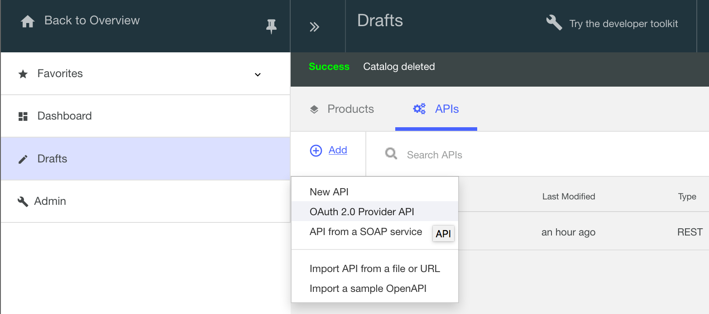
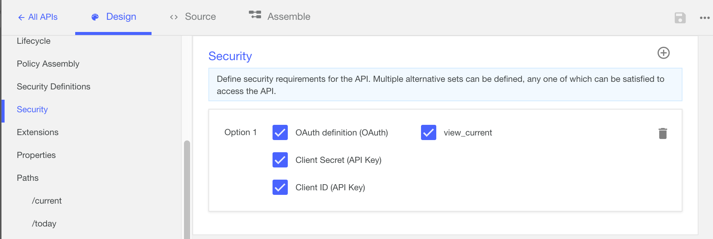

# Secure your API with two-legged OAuth

Duration: 10 mins  
Skill level: Beginner

### Objective

This tutorial is to guide you through securing your API using a two-legged OAuth 2.0 flow. In this application flow, the OAuth client initiates a request with the authorization server, and received an access token. The OAuth client can then use the token to access protected resources through your API.

### Prerequisites

Completed Part 2a

### Create an OAuth Provider API, and select your OAuth scheme
1. From Drafts / APIs, click **Add > OAuth 2.0 Provider API**
    
    * Title it "OAuth Endpoint API" (the name and base path should be populated automatically)
    * Click Create
    * In the newly created OAuth Endpoint API, scroll down to the **OAuth2** panel, and select "Confidential" as the Client Type
    * Under Scopes, rename _scope1_ to _view_current_; delete _scope2_ and _scope3_
    * Under **Grants**, deselect **Implicit, Password and Access Code**. Leave **Application** selected
    * Save your API
      

2. Update the Security Definition of your Weather Provider API to include OAuth
    * Switch over to your _Weather Provider API_
    * Under Security Definitions, add a new definition for OAuth; name it "OAuth definition"
    * Update the Flow to Application
    * Enter the token URL _<your base URL>/oauth-endpoint-api/oauth2/token_
    * Add a new Scope: view_current
      
    * Under **Security**, select **OAuth Definition** and **view_current**, and keep the Client ID and Client Secret selected
      
    * Save, and switch over to **Drafts / Products**
    * Add the OAuth Endpoint API to your Weather Provider product
    * Save the product, and stage it to your Sandbox
      

3. Test your OAuth security configuration
    * Publish your updated product to the sandbox; click **Dashboard > Sandbox**, and then publish your product
    
    * Click on **Explore > Sandbox**
      
    * In your **Weather Provider API**, select **GET /current** from the list of operations
    * In the right-hand panel, notice that Client ID and Client Secret are already populated
    * In the **Parameters** section, enter a zipcode
      
    * In the **Authorization** section, click on **Authorize** to get your access token
    * Once you've received your access token, click on Call operation to complete your test
    

4. Notice that the request includes the access token, Client ID and Client Secret.
    * To pass only the access token in the request, you will need to remove the Client ID and Secret from the security requirements for the Weather Provider API.
    
    * Save your Weather Provider API, stage and publish it to the Sandbox. Then from the Explore tool, run the same test as you previously did
    
