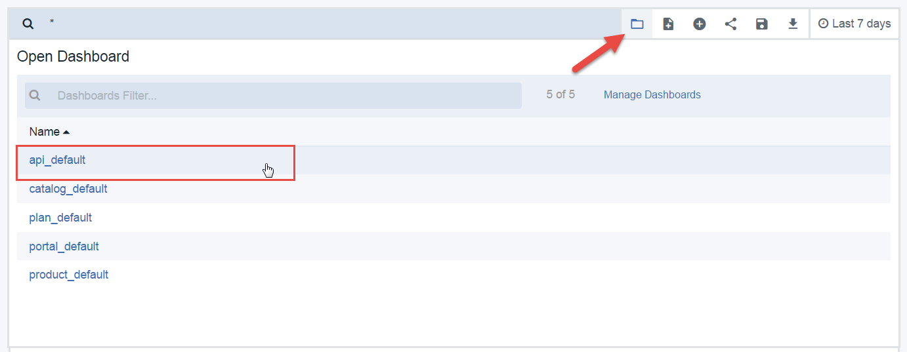
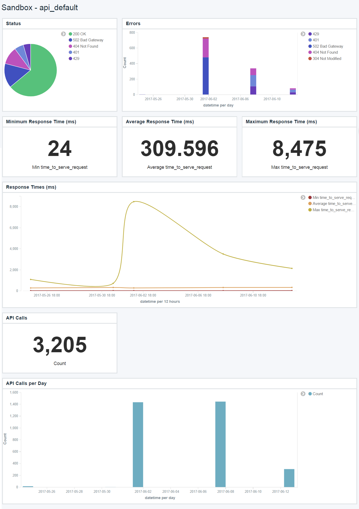
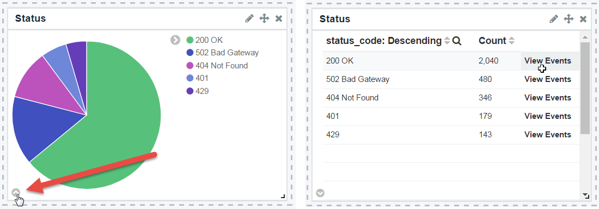
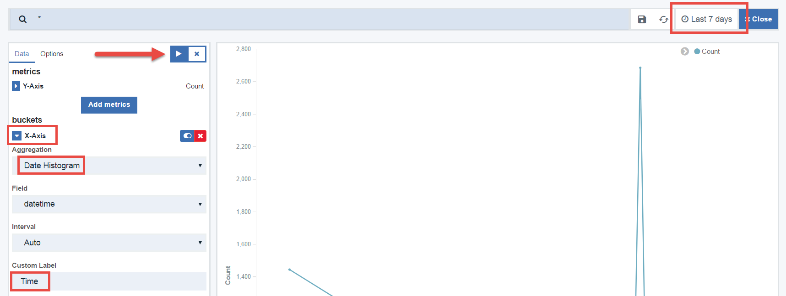
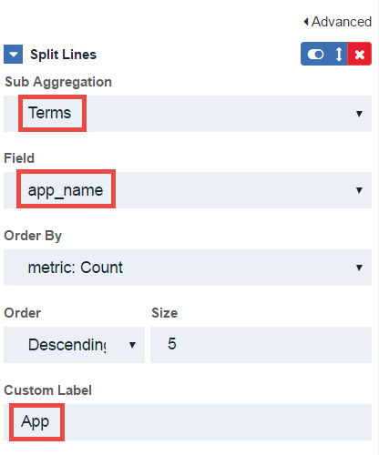

# Basic Analytics
**Duration**: 30 mins  
**Skill level**: Beginner

### Objective
This is a basic introduction to API analytics in API Connect. We'll tour the available analytics dashboards, and you can follow along with your own APIs.

### Prerequisites
In order to view your own API analytics, you must have an API Product created and published. Additionally, you'll need to call your API several times, preferably using a client id from a registered application (not the pre-provisioned test app).

To generate the data in this walkthrough, we used Postman's *Collection Runner* to call an API several times, with varying data and client ids. You can use a similar tool (like HttpRequester for Firefox), or just use cURL to call your API multiple times from the command-line. Recall that you can obtain sample requests for your API by clicking the **Explore** link in API Connect.

### Introduction to Catalog Analytics
As an API owner, you need a way to assess the success and performance of the APIs you offer. The main place you'll look for analytics is at the catalog level. If you have not been introduced to catalogs please read along [here!](https://www.ibm.com/support/knowledgecenter/en/SSMNED_5.0.0/com.ibm.apic.apionprem.doc/conref_working_with_env.html)! 

You, and your App developers can also access app-specific analytics in the Developer Portal, but in this tutorial we'll focus on Catalog Analytics.

You have access to real-time and historical (up to 90 days' worth) information regarding APIs and Products (and who is calling them) published to that catalog. (If your catalog has multiple spaces, you can drill down further to the Space level.)

This tutorial consists of a few activities to show you how to:
* View analytics
* View event record details
* Build new dashboards
* Creating new visualizations

### Activity 1: Viewing Out of the Box Analytics
1. In your API Connect service on Bluemix, launch your Dashboard and click to open the Catalog of interest. 
2. Click the Analytics tab.

    
  
You'll see the default Overview dashboard, showing two bar chart visualizations based on data from the last 7 days: 5 Most Active Products and 5 Most Active APIs. 

3. Hover over any of the bars to see additional details - like the API count, api names, etc.

    

4. Use the search bar to filter the data shown. You can also select a different time filter and/or auto-refresh rate. The visualizations will update to reflect your selections.

There are other dashboards provided out of the box for you. 
5. Click the folder icon to load a saved dashboard, and select **api_default** from the dropdown list.

    

This dashboard has a different set of visualizations, depicting API status, errors, response times, total number of calls, and calls per day.

    

### Activity 2: Viewing Event Details

Visualizations are a great way to get a useful overview of data, but you also need a way to drill down into the event records behind the charts.

1. Hover over the bottom left corner of any visualization. 
2. A small arrow should appear. If you click the arrow, you can see a table of the data behind that visualization. 
3. The **View Events** label is clickable as well - there, you can drill down into the individual event details (up to 100 records).

    

You can edit, move, and delete visualizations on your dashboard.

### Activity 3: Building new dashboards

Now, let's create a new dashboard that will provide view of API traffic patterns These are all available using built-in visualizations. 

1. Click the new dashboard icon and click the **Choose from existing visualizations** link. 

    

2. A list of available visualizations will be displayed. Select a few to add to your dashboard, for example:
  * Subscribed Apps
  * Apps per Plan 
  * Success Rate
  * API Calls per Day
  * Success Rate
3. Click the Save button and give your dashboard a name: ``Subscriber Dashboard``.

   

    

### Activity 4: Creating new visualizations
On the Subscriber dashboard we created above, we include the built-in visualization API Calls per Day. However, when we look at all this information presented together, we'd really like to see the usage by App. Let's create a new visualization that shows this information.

1. Click the new Visualization button and then click the Create Visualizations link.
    

2. Select **Line chart** as your visualization type.
3. The initialized line chart has the Y-Axis setup with a count of API calls. This is appropriate for our chart.
4. Select the following:
	* Buckets type: **X-Axis**
	* Aggregation: **Date Histogram**
	* Custom Label: **Time** 
5. Click the Run button to see your chart (you may need to adjust your time frame to see data.)

   

This chart (so far) just shows a time series of API calls. Recall, we want to see API calls by app name.

6. Click the **Add sub-buckets** button.
7. Select:
	* Buckets type: **Split Lines**
	* Sub Aggregation: **Terms**
	* Field: **app_name**
	* Custom Label: **App**
	
   
8. Click the Run button to see your chart.
9. Click the Save button and give your chart a name ``API Calls by App``.
10. To see your visualization in context, add it to the Subscriber dashboard.

   
 
There is a lot of other information available for visualizing details about API calls, callers, and so on. A full list of API events is available in the API Connect knowledge center, or in the list of Terms when you create visualizations.

### Conclusion: Gaining insights

The ability to visualize API analytics in different styles and combinations gives you an opportunity to draw conclusions or go deeper into your API data than otherwise. You can use this insight to make decisions about which APIs to offer, when to replace or retire an API, who is consuming your APIs, and so on.

For example, an API provider "ACME" has had version 1 (v1) and version 2 (v2) of an API running for several years. They deprecated v1 when they released v2. They also ensured existing v1 consumers were aware that they had a certain timeline to move to v2. As this deadline approaches, ACME wants to see how quickly consumers are moving off v2, so they can offer assistance to valued partners. 

Using a visualization to the one we just built, ACME has this information available at a glance.

*todo: insert screencap of graph here, after I build something attractive & simple*

In this tutorial, we walked through a number of activities to help you create useful combinations of API & consumer data. Using visualizations and dashboards, we quickly created tools to help API owners offer the right mix of APIs.

