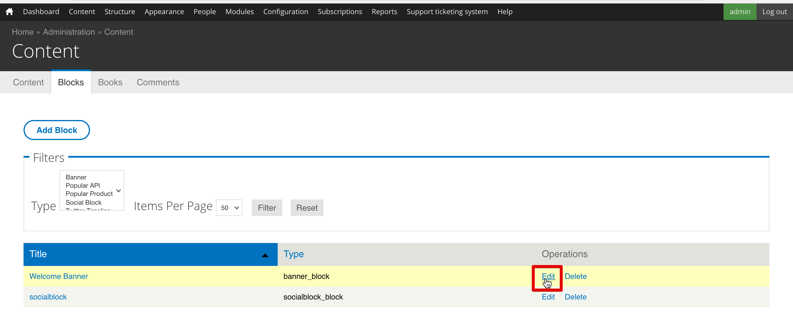
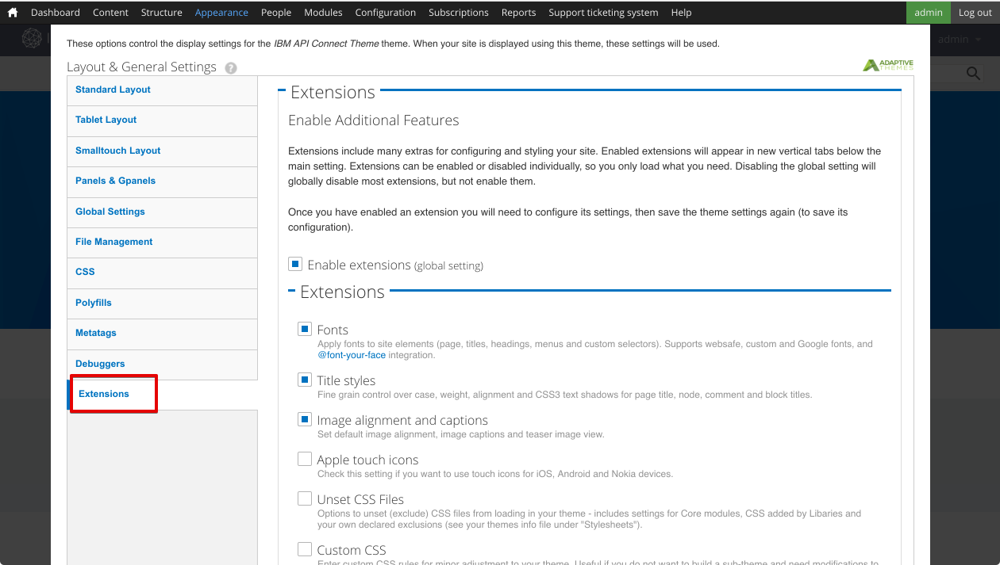
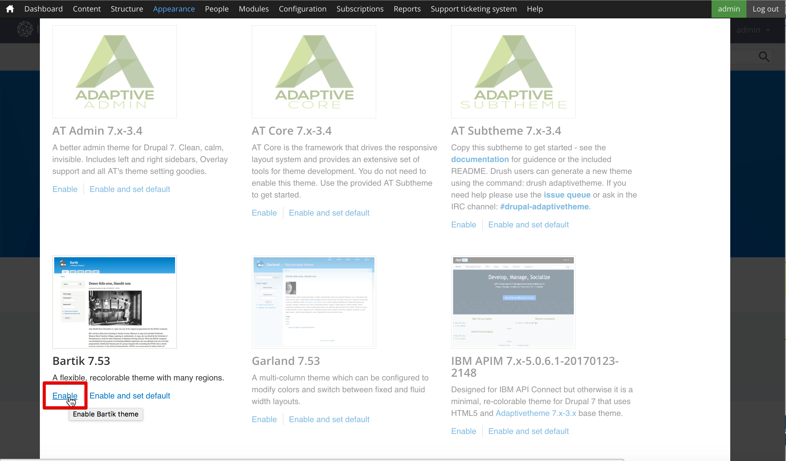
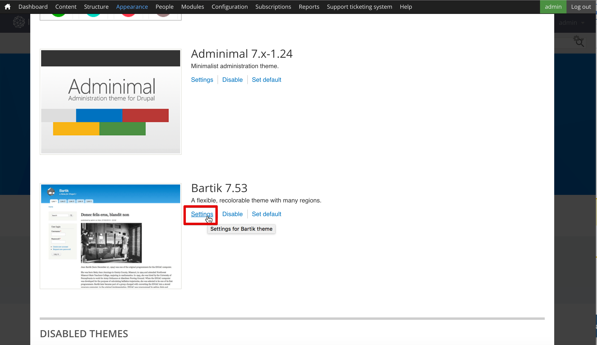

---

copyright:
  years: 2017
lastupdated: "2017-05-16"

---


{:new_window: target="_blank"}
{:shortdesc: .shortdesc}
{:screen: .screen}
{:codeblock: .codeblock}
{:pre: .pre}

# Customize Your Developer Portal and Select a Theme
**Duration**: 30 mins  
**Skill level**: Beginner  

### Objective
This tutorial is to help you get started quickly with customizing your **API Connect Developer Portal** and selecting a theme that suit your needs.

---

### Customizing your developer portal
After you have created your developer portal you can custimize its look and feel, in this tutorial you will learn how.

1. Let's begin with modifying the Welcome Banner. In the top menu select **Content** then select **Blocks**.  
  

2. Select **edit** in the **Welcome Banner** block.  
  

3. Under the Content heading, to change the Content text and image for the Welcome banner, you can either enter text into the content editor, or select the Edit HTML Source icon to edit or paste HTML directly that defines image and text specifications.  
   

4. Under the Image heading, browse for the required image, and select **Update**.  
  

5. At the bottom of the page select **Save** to save your changes.  
  
---

### Customize the theme for your developer portal
The Developer portal allows you to modify the theme it uses to change its look and feel.

1. To modify the theme from the top menu select **Appearance** then select **Settings** then **IBM API Connect Theme**.  This is the default theme when you created your developer portal above.
   

2. The *Standard Layout* tab allows you to modify the layouts for devices with large screen such as desktops.  The *Tablet Layout* tab allows you to modify the layouts used on tablet devices.  The *Smalltouch Layout* allows you to modify the layouts used on devices such as smartphones.  After inspecting these tabs select **Panels & Gpanels** 
  

3. In addition to modifying the Sidebar layouts above the default theme supports the use of Gpanels, or responsive Panels if you install the Panels module.  To control the panels layout on standard, tablet and smalltouch devices, expand the sections and update the settings.  
   

4. There are other settings that you can adjust but let's skip down and select **Extensions**. This tab allows you to enable additional settings you can use   to configure the styling of your developer portal.  
  

5. The settings of the extensions enabled on the *Extensions* tab can be modified in the **Extensions** section below the main settings.     
  

6. After the settings modifications are complete select **Save configuration** at the bottom of the page.

---

### Select a different theme for your developer portal
The Developer portal comes with additional themes for you to choose from and customize to change its look and feel.

1. To enable a different theme select **List** tab at the top of the Appearance settings.
   

2. At the top of the *Lists* tab the enabled themes are displayed. 
  

3. Below the list of enabled themes are a collection of disabled themes.  You can enable a theme by selecting **Enable**   
   

4. Once the theme is enabled it will appear at the top of the *List* tab in the **Enabled Themes**.  You can customize it by selecting **Settings**.  
  

5. Once you are done modifying the settings you can set the theme as the default by selecting **Set Default**.     
  

---

### Install a new theme for your developer portal
If modifying an existing theme doesn't suit your needs, the Developer portal allows you to install a theme to change its look and feel.

1. You can use modules or themes downloaded from [drupal.org](http://drupal.org) to customize your developer portal or you can create your own.

2. To install a theme into the developer portal from the top menu select **Appearance** then select **Install new theme**.  
  

3. You can install themes directly from [drupal.org](http://drupal.org) using a URL or you can upload a theme you downloaded or created by select **Choose File** and browse for the theme and then select **Install**.  
   

4. When the upload completes we need to enable the theme, select **Enable newly added themes**.  
  

5. Scroll down in the list and find the newly installed theme. Select **Enable and set default**.  
  

6. At the bottom of the page select **Save** to save your changes.  

This completes this tutorial.

  

  
